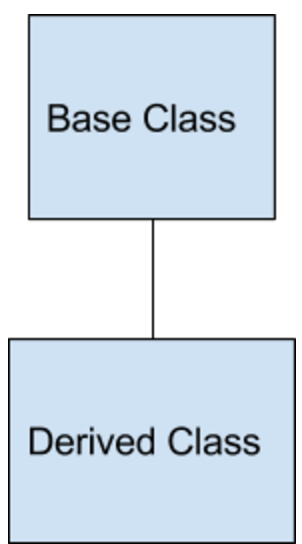

# Inheritance

 In C++ we can derive a class from another class, called a base. The derived class can access members and functions of the base class.



## **Access Control for Inherited Classes**

Let's look at this bit of code from our example:

```c++
//The derived class with Student as base class
class GradStudent : public Student
{
    private:
        string degree;
    public:
        GradStudent();
        void setDegree(string degreeIn);
        string getDegree();
};
```

Notice the line:

```c++
class GradStudent: public Student
```

The access control before the base class (in this case 'public') determines the access of the inherited class.

There are three types of access control: public, private, and protected.

- **Public Inheritance** means all public members of the base class are accessible to the derived class
- **Private Inheritance** means all members of the base class are private to the derived class
- **Protected Inheritance** means all members of the base class are protected to the derived class.

It is very rare to have a protected or private inheritance, the vast majority of the time inheritance is public.

**An example of private inheritance.**

Even though private inheritance is rare, let's look at an example.

In the program below, the inheritance is now private:

```c++
//The derived class with Student as base class
class GradStudent : private Student
{
    private:
        string degree;
    public:
        GradStudent();
        void setDegree(string degreeIn);
        string getDegree();
        void setStudentId(int idIn); //need this to access Student::setId()
        int getStudentId(); //need this to access Student::getId()
};
```

Now that we have a private inheritance, the Student member functions setId() and getID() are no longer available to the GradStudent class.

When we write the member functions, we must explicitly refer to the Student class.

```c++
int GradStudent::getStudentId()
{
    //We must access getId() as a private function
    return Student::getId(); 
}
void GradStudent::setStudentId(int idIn)
{
    //We must access setId() as a private function
    Student::setId(idIn); 
}
```

## Multiple Inheritance

C++ classes can inherit from more than one class. This is known as "Multiple Inheritance".

The form for declaring multiple inheritance is:

```c++
class DerivedClass : access BaseClass1, ... ,access BaseClassN
```